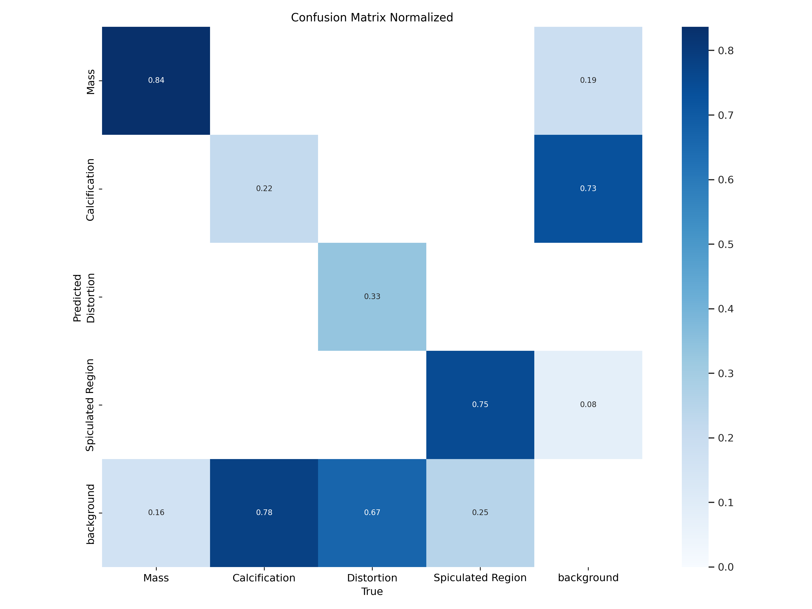
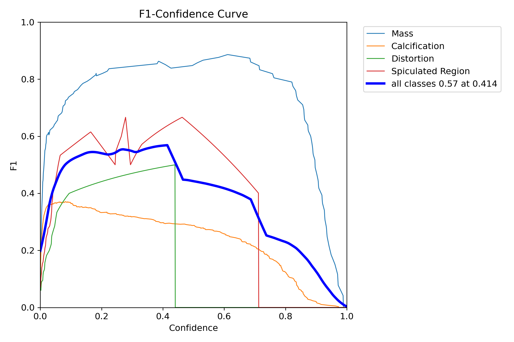
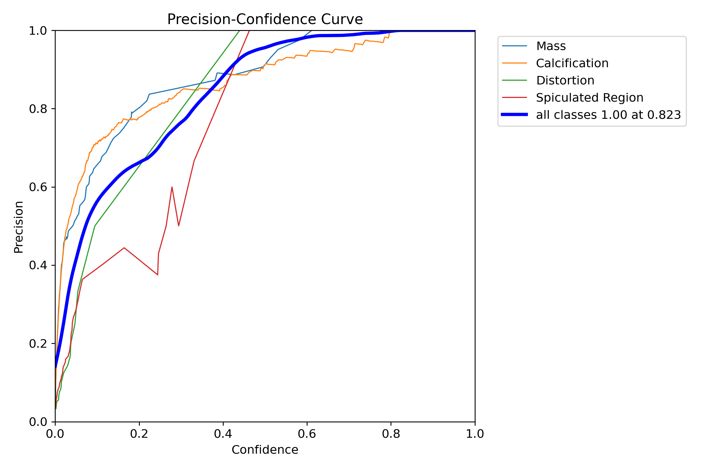
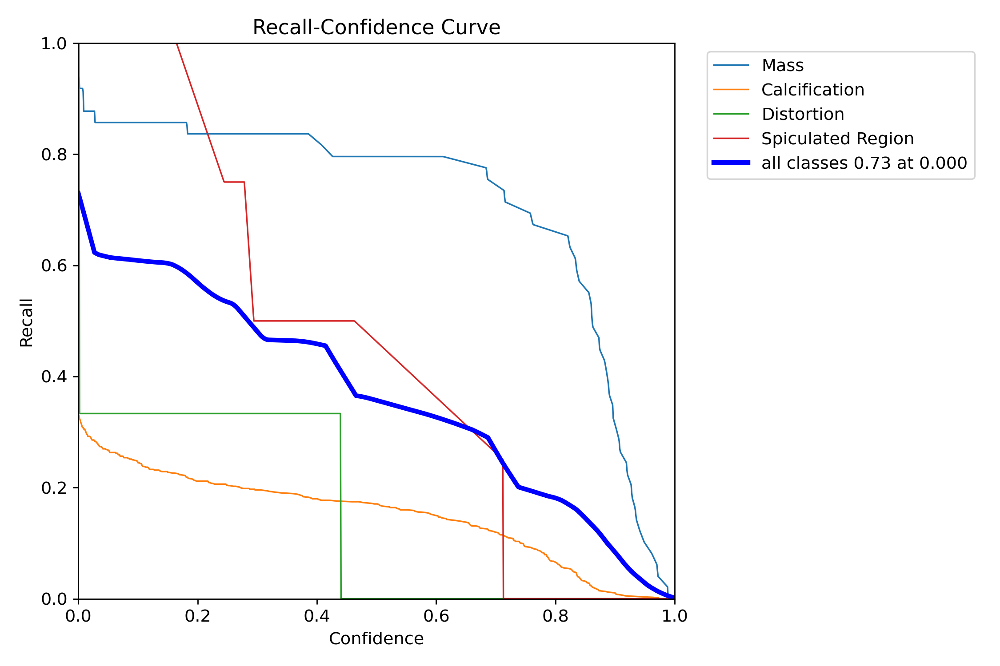
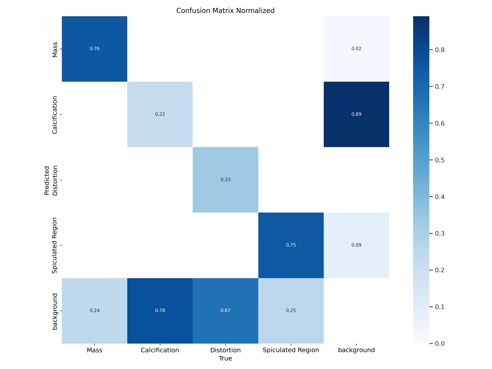
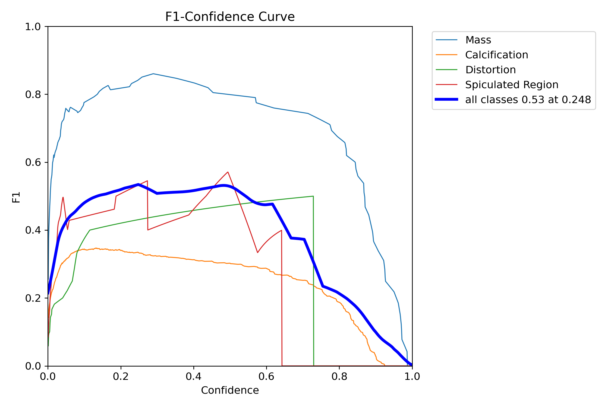
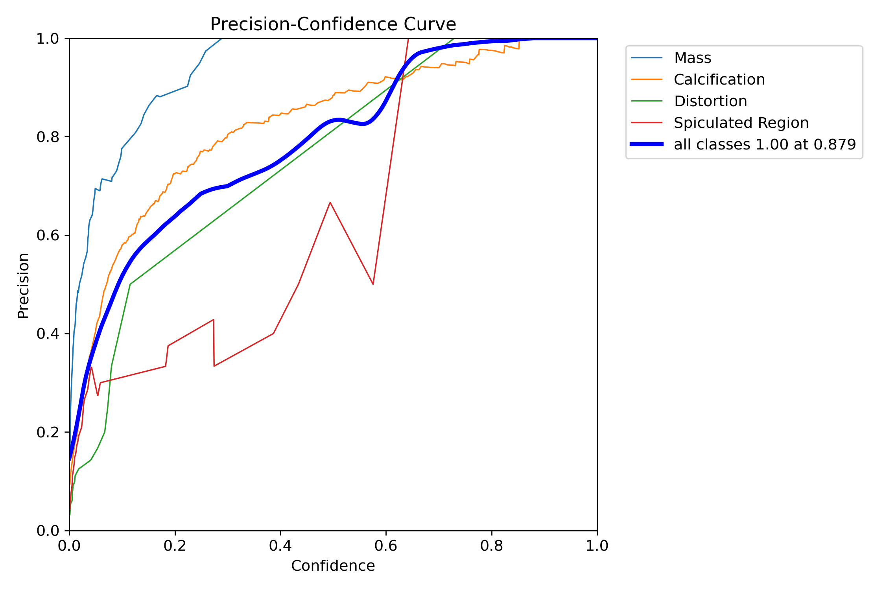
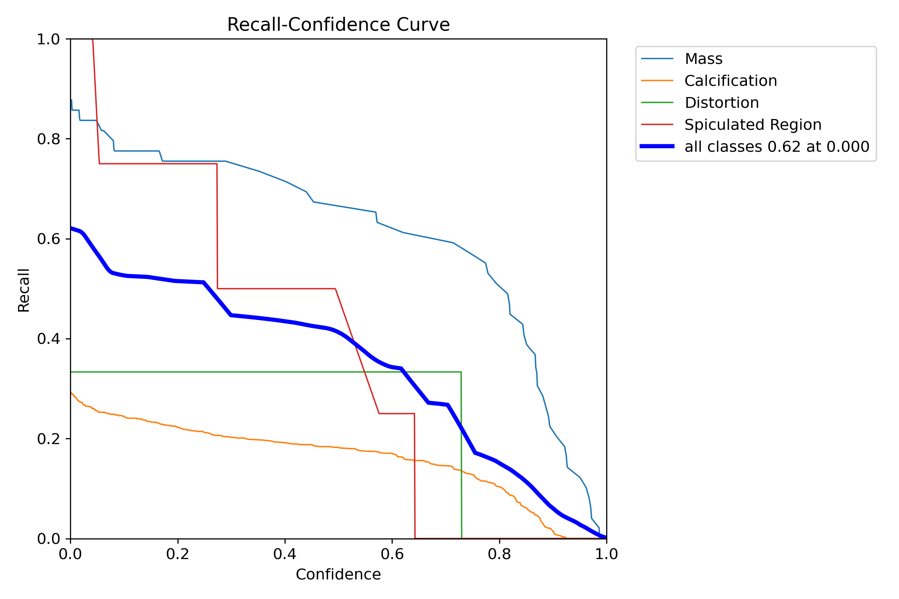
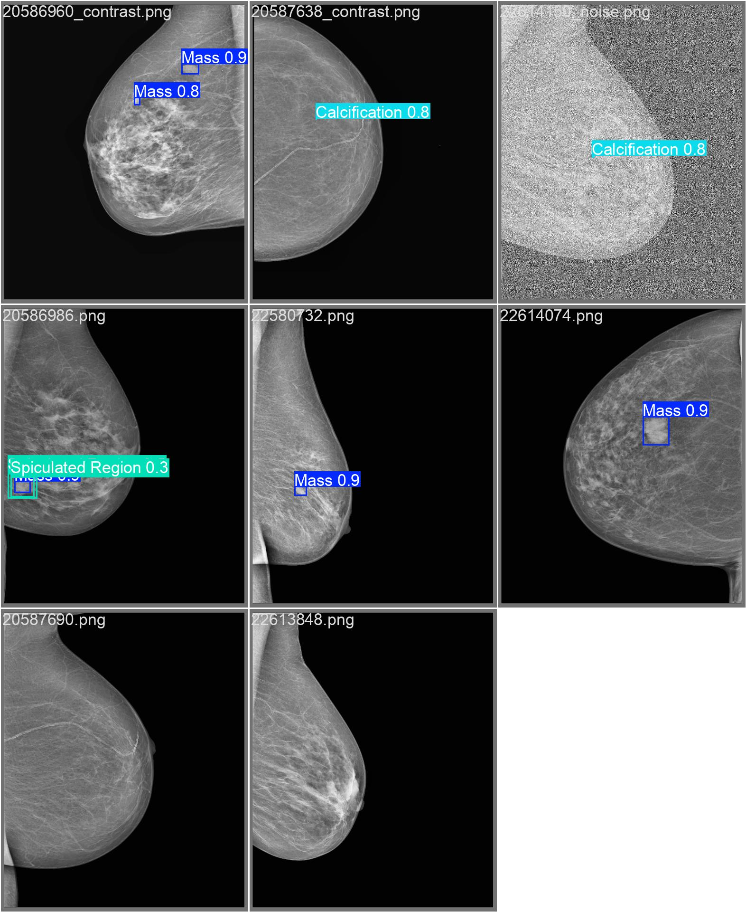
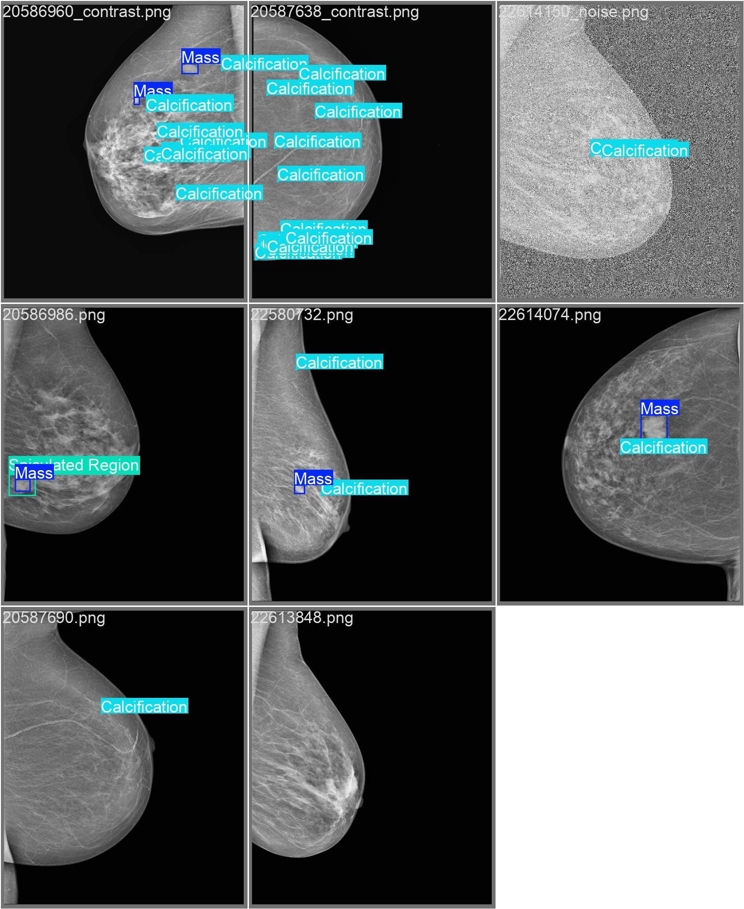

# *Mammography CAD system*
AI-powered mammography image processing pipeline for mass detection, segmentation,
classification, and enhancement using deep learning. 

## Table of Contents
1. [About the project](#1-about-the-project)
2. [Experiment results](#2-experiment-results)
3. [How to use](#3-how-to-use)


## 1. About the project
This is the repository for the implementation of a complete Computer-Aided Detection and Diagnosis (CADe/CADx) system for mammogram analysis. 

It implements:
- A mass detection stage, performed through YOLOv8 model
- An instance segmentation stage, performed throug YOLOv8-seg model
- A ResNEt-based classification

Developed for future pre-processing:
- GAN-based super-resolution

### Abstract
This project presents a Computer-Aided Detection and Diagnosis (CADe/CADx) system for mammogram analysis that integrates deep learning techniques for image enhancement, mass detection, segmentation, classification. The system is trained and evaluated on the INBreast dataset which is particularly suitable for this purpose due to its high-resolution images and detailed ground truth annotations. Our proposed pipeline begins with a pre-processing stage in order to improve model robustness, this includes data augmentation techniques such as contrast enhancement, noise addition and CLAHE. Successively it exploits a YOLOv8-based mass detection and instance segmentation model and a ResNet-based classifier to differentiate between benign and malignant masses. An Enhanced Super-Resolution GAN (ESRGAN) was also implemented with the goal of improving fine detail preservation, which is crucial for detection, segmentation, and classification. While ESRGAN is not currently integrated into our CADe/CADx system, future iterations may explore its use as a pre-processing step to further improve performance.
RESULTS

Undoubtedly, employing a larger model and modifying the epochs and batch, would have been beneficial. However, our computational resources were limited, making this approach unfeasible.

### Dataset
The dataset we are using is *INBreast*.
The INBreast dataset is a high-quality mammographic database designed for breast cancer research. 
It consists of 115 cases from 90 different patients, with a total of 410 full-field digital mammograms (FFDMs) in DICOM format.
Each image is expert-annotated with regions of interest (ROIs), which are labeled as masses, calcifications, distortions
or spiculated regions.
The dataset provides both:
- annotations related to ROIs of each image (including lesion properties such as size, intensity statistics, and contour
points in pixel and millimeter spaces), available in XML format.
- metadata (e.g., BIRADs class) in CSV format.

The high-quality annotations and comprehensive lesion diversity made the
INbreast dataset particularly suitable for our system tasks.

## 2. Experiment results
... 
TO PUT image of the table with results compared between different versions of model
- yolov8n
- yolov8m

### Detection
Here are the normalized confusion matrix, F1 curve, Precision curve, and Recall curve obtained by running respectively YOLOv8.s (Small)and YOLOv8.m (Medium)(s) on the augmented dataset with CLAHE applied

#### *YOLOv8.s*
<p>
  
  
  
     
</p>

#### *YOLOv8.m*

<p>
  
  
  
    
</p>

This is an example of the prediction output of our detection model (bounding boxes and class probabilities) in comparison to the annotated images already present on the dataset

<p>
  
  
</p>


## 3. How to use
This project is implemented on a *Linux-based operating system* (Ubuntu 22.04.5 LTS, 64-bit).
A working Python environment is needed to run the code. 

Thus, it is recommended to create a Conda environment for this purpose.


### Requirements
As first step, please install the dependencies needed to run the system.
```shell
pip install -r requirements.txt
```

### Data collection 
INbreast dataset is publicly avaiable at this link: https://www.kaggle.com/datasets/ramanathansp20/inbreast-dataset .
Once you have downloaded and unzipped the data, you have to place inside data/raw/ repository the following folders/files:
- AllDICOMs
- AllXML
- INbreast.csv 

The *data* directory should have the following structure:
```graphql
    mammography_CAD
    │── data/                  # Datasets and preprocessing scripts
    │   │── raw/               
    │   │   │── AllDICOMs/            # DICOMs folder
    │   │   │   │── 20586908_6c613....dcm
    │   │   │   │── 20586934_6c613....dcm
    │   │   │    ...
    │   │   │── AllXML/               # XML folder
    │   │   │   │── 20586908.dcm
    │   │   │   │── 20586934.dcm
    │   │   │   ...
    │   │   └── INbreast.csv/         # CSV file
    │   │
    │   │── processed/         # Preprocessed data 
     ...

```

### Data preprocessing
To preprocess the dataset, go to *data/* directory and run dataset_preparation.py script. 
This step can be executed by running consequently the following commands
```shell
    cd data
    python dataset_preparation.py
```
   And then come back to the main directory

```shell 
    cd -
```
Once the preprocessing step is completed, the PNG processed images results to be located in `data/processed/` directory, while the JSON files are located in `data/json/` directory.

Specifically, it generates:
- the converted version of INbreast images from DICOM to PNG format (*`AllPNG`*)
- the augmented version of the dataset (augmentations: contrast adjustment, noise addition) in PNG format (*`augmentedPNG`*)
- the previous augmented version of the dataset enhanced using **CLAHE** (Contrast Limited Adaptive Histogram Equalization) (*`clahePNG`*)
- the file JSON containing a dictionary with information from INbreast.csv and from the annotations in XML format (*`dataset.json`*)
- the file JSON containing a dictionary with information from INbreast.csv and from the annotations in XML format for the augmented dataset (*`augmented.json`*)


### Running the CAD system

Once everything is set, we can start to run the system.
For detection and instance segmentation stages, the system uses the pre-trained YOLOv8 (initialized with pretrained weights from COCO dataset), which is 
then fine-tuned on the mammography dataset.

#### 1. Detection stage (YOLOv8)

- First of all, the dataset labels must be structured to ensure compatibility with the YOLOv8 model configured for object detection.
\
Additionally, the dataset should be split into training, validation, and test sets to properly train and evaluate the YOLOv8 model.\
For these purposes, run the `main_det.py` script as follows
     ```shell
      python main_det.py --mode split --data clahe
     ```
  As show in the above command, it is possible to choose to perform detection task using the augmented dataset *with or without the CLAHE enhancement*.\
  To specify which version of the dataset to use, include either `clahe` or `augmented` as part of the `--data` argument in the Python command.


- For training the detection system, use the following command
    ```shell
      python main_det.py --mode train --model yolov8m.pt --epochs 70 --batch 4
     ```
    Another choice is related on which pre-trained version of the Yolov8 model you want to train, which could be either `yolov8n.pt`, `yolov8s.pt` or `yolov8m.pt`.

    The epochs and batch size are also configurable, thus they can be adjusted based on the computational resources available, 
such as the GPU capabilities and overall system performance. 

The training results will be saved in `runs/detect/` directory
 
#### 2. Instance Segmentation stage (YOLOv8)

- As in detection stage, the dataset labels must be structured to be compatible with the YOLOv8 model, which is configured now for instance segmentation.
\
Additionally, the dataset should be split into training, validation, and test sets to properly train and evaluate the YOLOv8 model.\
For these purposes, run the `main_seg.py` script as follows
     ```shell
      python main_seg.py --mode split --data clahe
     ```
  As for detection, it is possible to choose to perform mass segmentation task using the augmented dataset *with or without the CLAHE enhancement*.\
  To specify which version of the dataset to use, include either `clahe` or `augmented` as part of the `--data` argument in the Python command.


- For training the mass segmentation system, use the following command
    ```shell
      python main_seg.py --mode train --model yolov8m_seg.pt --epochs 80 --batch 4
     ```
    
    The pre-trained version of the Yolov8 model can be selected among either `yolov8n_seg.pt`, `yolov8s_seg.pt` or `yolov8m_seg.pt`.


The training results will be saved in `runs/segment/` directory


#### 2. Classification stage (modified ResNet)

- First, we have to split the dataset in *train, val* and *test* sets, running the following command
    ```shell
    python main_class.py --mode split --json_path data/json/augmented.json --out_dir data/json/class
    ```
- Then, for training the classification model, run the command below
    ```shell
    python main_class.py --mode train --json_path data/json/class/train.json --img_dir data/processed/clahePNG --mask_dir data/mass_masks --epochs 80
    ```
- For evaluating the classification model, run the command below 
    ```shell
    python main_class.py --mode eval --json_path data/json/class/val.json --img_dir data/processed/clahePNG --mask_dir data/mass_masks --epochs 80
    ```


### Running the Super Resolution GAN system
- To create high-resolution and low-resolution pairs and then split the dataset in *train, val* and *test* sets, run the following command
 ```shell
    python main_esrgan.py --task split --data clahe
 ```
It is possible to use the augmented dataset *with or without the CLAHE enhancement* also at this stage.\
As before, to specify which version of the dataset to use, include either `clahe` or `augmented` as part of the `--data` argument in the Python command.

- For training the ESRGAN, run the following command
 ```shell
    python main_esrgan.py --task train
 ```

- For evaluating the ESRGAN, run the following command
 ```shell
    python main_esrgan.py --task eval
 ```

